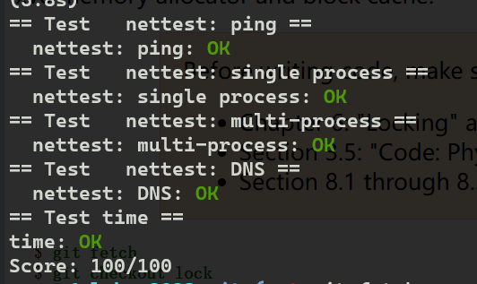

## Lab7: networking

### 背景

在局域网上，xv6（客户）ip地址为10.0.2.15，本地电脑为10.0.2.2。当xv6发包给10.0.2.2，qemu会把发给电脑上合适的程序。

将会使用用户模式网络栈（user-mode network stack）。

#### user-mode network stack

[Documentation/Networking - QEMU](https://wiki.qemu.org/Documentation/Networking#User_Networking_.28SLIRP.29)

这是默认的网络后端，通常是最容易使用的，不需要root特权。有4个缺点：

- 开销很大，性能差
- 一般，icmp 通信不能工作（不能再客户机使用ping）

关于icmp [互联网控制消息协议 - 维基百科，自由的百科全书 (wikipedia.org)](https://zh.wikipedia.org/zh-cn/互联网控制消息协议) 看不太懂，还没学计网。

- 在linux主机上，ping能够在客户机工作，但需要先通过root设置。
- 客户机不能直接从主机或外部网络访问。

用户网络通过“slirp"实现。slirp在qemu上提供一个满的tcp/ip协议栈，并使用栈实现一个虚拟NAT网络。


使用-netdev user来配置用户网络。

没看太懂，不过按照惯例，往下看应该还是能看懂。

看了下e1000的开发人员指南，看得有点蒙。

由于这一节感觉很难，所以参考了一下网上的博客。[[MIT 6.S081\] Lab 11: networking_c版本的e1000网卡实现-CSDN博客](https://blog.csdn.net/LostUnravel/article/details/121437373)

###  `e1000_transmit`

```c
int
e1000_transmit(struct mbuf *m)
{
  //
  // Your code here.
  //
  // the mbuf contains an ethernet frame; program it into
  // the TX descriptor ring so that the e1000 sends it. Stash
  // a pointer so that it can be freed after sending.
  //
  //printf("e1000_transmit start.....\n");
  	acquire(&e1000_lock);
	uint64 offset = regs[E1000_TDT]; // hint 1
	if(!tx_ring[offset].status)
	{
		release(&e1000_lock);
		printf("e1000_transmit: the ring is overflowing\n"); // hint 2
		return -1;
	}else{
		// hint 3

		if(tx_mbufs[offset]){
			mbuffree(tx_mbufs[offset]);
			//tx_mbufs[offset] = 0;
		}
	}


	// hint 4
	tx_ring[offset].addr = (uint64)m->head;
	tx_ring[offset].length = m->len;
	tx_ring[offset].cmd = E1000_TXD_CMD_EOP | E1000_TXD_CMD_RS;
	tx_mbufs[offset] = m;

	// hint 5
	regs[E1000_TDT] = (regs[E1000_TDT] + 1) % TX_RING_SIZE;

	release(&e1000_lock);
  
  return 0;
}
```

根据几个hint写下来，将内存中的buf移动到tx_ring上来。E100_TDT是指向下一个包的索引。E1000_TXD_STAT_DD设置是代表发送请求结束，否则没有。

###  `e1000_recv`

```c
static void
e1000_recv(void)
{
  //
  // Your code here.
  //
  // Check for packets that have arrived from the e1000
  // Create and deliver an mbuf for each packet (using net_rx()).
  //
  //printf("e1000_recv start.....\n");
  
  //acquire(&e1000_lock);

  uint64 offset = (regs[E1000_RDT] + 1) % RX_RING_SIZE; // hint 1
  //if(offset + 1 == regs[E1000_RDH])
	//return; 
  while(rx_ring[offset].status & E1000_RXD_STAT_DD){
	  // hint 2
	  // hint 3
	  rx_mbufs[offset]->len = rx_ring[offset].length;
	  net_rx(rx_mbufs[offset]);
	  // hint 4
	  struct mbuf* newbuf = mbufalloc(0);
	  if(!newbuf)
		  panic("e1000_recv");
	  rx_mbufs[offset] = newbuf;
	  rx_ring[offset].addr = (uint64)newbuf -> head;
	  rx_ring[offset].status = 0;
	  offset = (offset+1) % RX_RING_SIZE;
  }

  // hint 5
  regs[E1000_RDT] = (offset - 1 + RX_RING_SIZE) % RX_RING_SIZE;

  //release(&e1000_lock);

}
```


这张图很好说明了为什么，使用tail加一来迭代。因为tx是将包交给硬件处理，而rx是将包由硬件交给软件处理.而软件控制tail，则都使用加法。

还有到达的数量可能多于环的大小。所以处理一定要及时，所以采用循环。还看到有一种直接在这个函数中死循环不出去，不知道这种方法的可行性，以后再探究。[MIT6.S081-Lab7 Lab Networking [2021Fall\] - duile - 博客园 (cnblogs.com)](https://www.cnblogs.com/duile/p/16277647.html#写在前面)



### 总结

这次涉及很多计网的知识，但是实现不用。但还是继续了解。

- 下次学了计网再来看这个实验。
- 看看源代码

