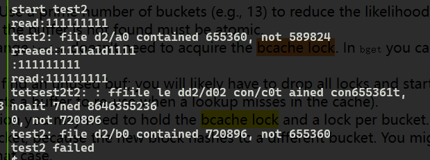
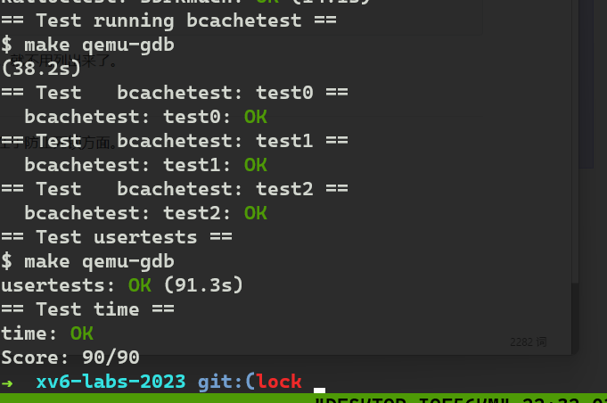

# Lab: locks

## Memory allocator ([moderate](https://pdos.csail.mit.edu/6.S081/2024/labs/guidance.html))

网页说，aquire维护了锁请求的数量，和循环中尝试获得锁失败的次数。从源码可以看出。

```c
// Acquire the lock.
// Loops (spins) until the lock is acquired.
void
acquire(struct spinlock *lk)
{
  push_off(); // disable interrupts to avoid deadlock.
  if(holding(lk))
    panic("acquire");

#ifdef LAB_LOCK
    __sync_fetch_and_add(&(lk->n), 1);
#endif      

  // On RISC-V, sync_lock_test_and_set turns into an atomic swap:
  //   a5 = 1
  //   s1 = &lk->locked
  //   amoswap.w.aq a5, a5, (s1)
  while(__sync_lock_test_and_set(&lk->locked, 1) != 0) {
#ifdef LAB_LOCK
    __sync_fetch_and_add(&(lk->nts), 1);
#else
   ;
#endif
  }

  // Tell the C compiler and the processor to not move loads or stores
  // past this point, to ensure that the critical section's memory
  // references happen strictly after the lock is acquired.
  // On RISC-V, this emits a fence instruction.
  __sync_synchronize();

  // Record info about lock acquisition for holding() and debugging.
  lk->cpu = mycpu();
}
```

导致kalloctest锁竞争的根本原因是kalloc中只有一个，free list，和一个锁。解决办法是每个cpu维护一个free list和一个锁。虽然可能一个cpu的free list为空，另一个不为空。这样不为空的cpu会被为空的cpu窃取部分free list，虽然这导致了竞争但是已经减少很多了。

> Your job is to implement per-CPU freelists, and stealing when a CPU's free list is empty. You must give all of your locks names that start with "kmem". That is, you should call `initlock` for each of your locks, and pass a name that starts with "kmem"

开始看hints

hint1 You can use the constant `NCPU` from kernel/param.h


最大数量的cpu

hint2 Let `freerange` give all free memory to the CPU running `freerange`.

把所有内存分配给正在运行freerange的那个cpu。

看不太懂，缓一下。

hint3 The function `cpuid` returns the current core number, but it's only safe to call it and use its result when interrupts are turned off. You should use `push_off()` and `pop_off()` to turn interrupts off and on.

当中断关闭才能调用cpuid函数和使用其结果。

hint4 Have a look at the `snprintf` function in kernel/sprintf.c for string formatting ideas. It is OK to just name all locks "kmem" though.

查看sprintf函数的实现。

```c
int
snprintf(char *buf, int sz, char *fmt, ...)
{
  va_list ap;
  int i, c;
  int off = 0;
  char *s;

  if (fmt == 0)
    panic("null fmt");

  va_start(ap, fmt);
  for(i = 0; off < sz && (c = fmt[i] & 0xff) != 0; i++){
    if(c != '%'){
      off += sputc(buf+off, c);
      continue;
    }
    c = fmt[++i] & 0xff;
    if(c == 0)
      break;
    switch(c){
    case 'd':
      off += sprintint(buf+off, va_arg(ap, int), 10, 1);
      break;
    case 'x':
      off += sprintint(buf+off, va_arg(ap, int), 16, 1);
      break;
    case 's':
      if((s = va_arg(ap, char*)) == 0)
        s = "(null)";
      for(; *s && off < sz; s++)
        off += sputc(buf+off, *s);
      break;
    case '%':
      off += sputc(buf+off, '%');
      break;
    default:
      // Print unknown % sequence to draw attention.
      off += sputc(buf+off, '%');
      off += sputc(buf+off, c);
      break;
    }
  }
  return off;
}
```

hint 5 一个工具

不知道hint4有什么作用·感觉没有用到。

初始化lock，使用一个循环。

hint2的实现实际上取决于kfree，所以将kfree修改就好了，修改时需要cpu的id，所以用到hint3。

kalloc的实现略微复杂，代码中注释的地方都是需要注意的点。

```c 
void
kfree(void *pa)
{
  struct run *r;

  if(((uint64)pa % PGSIZE) != 0 || (char*)pa < end || (uint64)pa >= PHYSTOP)
    panic("kfree");

  // Fill with junk to catch dangling refs.
  memset(pa, 1, PGSIZE);

  r = (struct run*)pa;

  push_off();
  int current_cpu=cpuid();
  acquire(&kmem.lock[current_cpu]);
  r->next = kmem.freelist[current_cpu];
  kmem.freelist[current_cpu] = r;
  release(&kmem.lock[current_cpu]);
  pop_off();
}

// Allocate one 4096-byte page of physical memory.
// Returns a pointer that the kernel can use.
// Returns 0 if the memory cannot be allocated.
void *
kalloc(void)
{
  struct run *r;

  push_off();
  int current_cpu = cpuid();
  acquire(&kmem.lock[current_cpu]);
  r = kmem.freelist[current_cpu];
  if(r)
    kmem.freelist[current_cpu] = r->next;
  else
	for(int i = 0; i<NCPU; i++)
	{
		if(i == current_cpu)// 涓嶈兘閲嶅鑾峰緱閿併€?			continue;
		release(&kmem.lock[current_cpu]);// to avoid deadlock
		acquire(&kmem.lock[i]);
		if(!kmem.freelist[i]){
			release(&kmem.lock[i]);
			acquire(&kmem.lock[current_cpu]);
			continue;
		}
		r = kmem.freelist[i];
		kmem.freelist[i]= r->next;
		release(&kmem.lock[i]);
		acquire(&kmem.lock[current_cpu]);
        if(r)break;// 鎷垮埌鍙互鐢ㄧ殑灏遍€€鍑恒€?	}
  release(&kmem.lock[current_cpu]);
  pop_off();

  if(r)
    memset((char*)r, 5, PGSIZE); // fill with junk
  return (void*)r;
}
```

## Buffer cache ([hard](https://pdos.csail.mit.edu/6.S081/2024/labs/guidance.html))

bcache.lock保护缓存的缓冲区列表，每个buf都有refcnt，还有表明身份的dev和blockno。

- 修改 bget 和 brelse，使 bcache 中不同块的并发查找和释放不太可能在锁上发生冲突(例如，不必等待 bcache. lock)。
- 必须保证每个块只有一个缓存的不变量。
- 不能增加缓冲区数量，只有NBUF=30个。
- 修改的缓冲区没必要使用lru替换，但一定要可以使用任意一个refcnt=0的struct bufs当没有命中缓冲区。

- That is, you should call `initlock` for each of your locks, and pass a name that starts with "bcache".
- We suggest you look up block numbers in the cache with a hash table that has a lock per hash bucket.

散列桶和散列表：

[6.2  哈希冲突 - Hello 算法 (hello-algo.com)](https://www.hello-algo.com/chapter_hashing/hash_collision/)

以前学习过，重温一下。

某些情况出现锁冲突是允许的：

- When two processes concurrently use the same block number. `bcachetest` `test0` doesn't ever do this.
- When two processes concurrently miss in the cache, and need to find an unused block to replace. `bcachetest` `test0` doesn't ever do this.
- When two processes concurrently use blocks that conflict in whatever scheme you use to partition the blocks and locks; for example, if two processes use blocks whose block numbers hash to the same slot in a hash table. `bcachetest` `test0` might do this, depending on your design, but you should try to adjust your scheme's details to avoid conflicts (e.g., change the size of your hash table).

hints：

- Read the description of the block cache in the xv6 book (Section 8.1-8.3).
- It is OK to use a fixed number of buckets and not resize the hash table dynamically. Use a prime number of buckets (e.g., 13) to reduce the likelihood of hashing conflicts.

使用素数桶来减少散列冲突的可能性。因为使用合数的话，桶就少了，用取模的方法分析。

- Searching in the hash table for a buffer and allocating an entry for that buffer when the buffer is not found must be atomic.

当buffer没被找到，在哈希表中寻找并分配一个buffer的入口，这个过程要原子性。很好理解，如果不是原子的，可能被中断，回来后就不是原来的数据了。

- Remove the list of all buffers (`bcache.head` etc.) and don't implement LRU. With this change `brelse` doesn't need to acquire the bcache lock. In `bget` you can select any block that has `refcnt == 0` instead of the least-recently used one.

删除拥有所有缓冲的链表，不适用lru替换。改变后，brelse不用获得bcache锁。在bget中选择refcnt == 0的块就行。

- You probably won't be able to atomically check for a cached buf and (if not cached) find an unused buf; you will likely have to drop all locks and start from scratch if the buffer isn't in the cache. It is OK to serialize finding an unused buf in `bget` (i.e., the part of `bget` that selects a buffer to re-use when a lookup misses in the cache).

你可能不会原子性地检查一个缓存的buf和找一个没使用的buf。你可能必须丢弃所有的锁并从头开始如果buffer不在缓冲区中。可以在bget中序列化查找一个未使用的buf，即bget的片段可以选择一个buffer来重用当在缓存中没找到。

- Your solution might need to hold two locks in some cases; for example, during eviction you may need to hold the bcache lock and a lock per bucket. Make sure you avoid deadlock.

bcache lock 和 bucket lock 。 避免死锁。

- When replacing a block, you might move a `struct buf` from one bucket to another bucket, because the new block hashes to a different bucket. You might have a tricky case: the new block might hash to the same bucket as the old block. Make sure you avoid deadlock in that case.

替换原则和特殊情况下避免死锁。

- Some debugging tips: implement bucket locks but leave the global bcache.lock acquire/release at the beginning/end of bget to serialize the code. Once you are sure it is correct without race conditions, remove the global locks and deal with concurrency issues. You can also run `make CPUS=1 qemu` to test with one core.

调试技巧：1.  在bget的开始和结束处保留全局bcache.lock的获取和释放。确保正确可以去掉。

2. make CPUS=1 qemu

- Use xv6's race detector to find potential races (see above how to use the race detector).

test2报错：



test2是测试并发创建缓冲区的。

这里显示file中原有的数据被修改，并且由于四个线路同时运行，发生了交错。

原因是，当是同一个blockno的两个进程，同时不命中，则有一个进程先进入分配，另一个则需检查是否在等待期间分配了新的buf。

```c
static struct buf*
bget(uint dev, uint blockno)
{
  //printf("dev:%d blockno:%d\n",dev,blockno);
  struct buf *b;

  //acquire(&bcache.lock);

  // Is the block with dev and blockno already cached?
  acquire(&bcache.bucket[blockno%bkts].lock);
  for(b = bcache.bucket[blockno%bkts].head.next; b != &bcache.bucket[blockno%bkts].head; b = b->next){
    if(b->dev == dev && b->blockno == blockno){
      b->refcnt++;
	  release(&bcache.bucket[blockno%bkts].lock);
      //release(&bcache.lock);
      acquiresleep(&b->lock);
      return b;
    }
  }
  release(&bcache.bucket[blockno%bkts].lock);

  // Not cached.
  // Recycle the least recently used (LRU) unused buffer.
  acquire(&bcache.lock);
  // firstly should check the cached buffer , because the bufs may have the same blockno
  acquire(&bcache.bucket[blockno%bkts].lock);
  for(b = bcache.bucket[blockno%bkts].head.next; b != &bcache.bucket[blockno%bkts].head; b = b->next){
    if(b->dev == dev && b->blockno == blockno){
      b->refcnt++;
	  release(&bcache.bucket[blockno%bkts].lock);
      release(&bcache.lock);
      acquiresleep(&b->lock);
      return b;
    }
  }
  release(&bcache.bucket[blockno%bkts].lock);

  for(int i=0; i<bkts; i++){
	  acquire(&bcache.bucket[i].lock);
	  b = bcache.bucket[i].head.next;
	  while(b != &bcache.bucket[i].head){
		if(b->refcnt == 0) {
			b->dev = dev;
			b->blockno = blockno;
			b->valid = 0;
			b->refcnt = 1;
			if( i!=blockno%bkts ){
				b->next->prev = b->prev;
				b->prev->next = b->next;
				// to avoid deadlock
				release(&bcache.bucket[i].lock);

				acquire(&bcache.bucket[blockno%bkts].lock);
				b->prev = &bcache.bucket[blockno%bkts].head;
				b->next = bcache.bucket[blockno%bkts].head.next;
				bcache.bucket[blockno%bkts].head.next->prev = b;
				bcache.bucket[blockno%bkts].head.next = b;
				release(&bcache.bucket[blockno%bkts].lock);
			}else
				release(&bcache.bucket[i].lock);
			release(&bcache.lock);
			acquiresleep(&b->lock);
			return b;
      	}
		b = b->next;
	  }
	  release(&bcache.bucket[i].lock);
  }
  panic("bget: no buffers");
}


```

brlese和其他函数的实现则比较简单，就不用列出来了。



## 实验小结

这个实验关键在于lock的使用，特别在于防止死锁方面。


