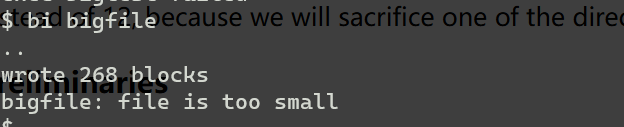

# Lab: file system

## File snapshots ([hard](https://pdos.csail.mit.edu/6.S081/2024/labs/guidance.html))

这个任务将实现文件的快照功能。和cow-fork lab相似，只有当某个块被修改才进行复制。

### Preliminaries

mkfs创建xv6文件系统镜像，决定文件系统拥有多少block。kernel/param.h中的FSSIZE就是大小。

make qemu:


说明了mkfs/mkfs创建了什么。

如果需要通过make clean 重新构建fs.img。

### What to Look At


这个图解释了dinode 结构体。

​	fs.c中的bmap()用来查找文件数据。读写文件时都会调用。当写文件，bmap按需分配新块来存储数据。

```c
// Inode content
//
// The content (data) associated with each inode is stored
// in blocks on the disk. The first NDIRECT block numbers
// are listed in ip->addrs[].  The next NINDIRECT blocks are
// listed in block ip->addrs[NDIRECT].

// Return the disk block address of the nth block in inode ip.
// If there is no such block, bmap allocates one.
// returns 0 if out of disk space.
static uint
bmap(struct inode *ip, uint bn)
{
  uint addr, *a;
  struct buf *bp;

  if(bn < NDIRECT){
    if((addr = ip->addrs[bn]) == 0){
      addr = balloc(ip->dev);
      if(addr == 0)
        return 0;
      ip->addrs[bn] = addr;
    }
    return addr;
  }
  bn -= NDIRECT;

  if(bn < NINDIRECT){
    // Load indirect block, allocating if necessary.
    if((addr = ip->addrs[NDIRECT]) == 0){
      addr = balloc(ip->dev);
      if(addr == 0)
        return 0;
      ip->addrs[NDIRECT] = addr;
    }
    bp = bread(ip->dev, addr);
    a = (uint*)bp->data;
    if((addr = a[bn]) == 0){
      addr = balloc(ip->dev);
      if(addr){
        a[bn] = addr;
        log_write(bp);
      }
    }
    brelse(bp);
    return addr;
  }

  panic("bmap: out of range");
}
```

先检查bn是否小于NDIRECT,如果小于则直接使用ip->addrs[bn]中的地址，大于则在ip->addrs[NDIRECT]这个块上（bn-NDIRECT）上的地址指向的块。这里的地址实际上只是序号，上一个lab的blockno。

bn是相对于文件的，而blockno是磁盘上的。bmap()将bn映射到blockno。

### Your Job

实现一个新的系统调用，生成一个已知文件的快照，快照共享这个文件的磁盘块。

- Implement the system call `snapshot`, which takes two arguments: the first is the file to be snapshotted, and the second is an unused file name for the snapshot. See `user/snaptest.c` for an example of the use of `snapshot`. To support `snapshot` add an entry to user/usys.pl, user/user.h, and implement an empty `sys_snapshot` in kernel/sysfile.c.

发现找不到snaptest，才发现我的库是2023版，遂下载了2024版的。之前没出问题大概是题目一样吧，毕竟每次都是满分。才想起来，今年是2024年，所以这个任务先暂停了。到时候回来补。

## Large files ([moderate](https://pdos.csail.mit.edu/6.S081/2024/labs/guidance.html))

这个任务增加xv6文件的最大大小。



这个测试失败，因为bigfile需要65803个block。

256*256+256+11。我们将牺牲某个直链来实现二次间接块。

### Preliminaries

同上。

### What to Look At

同上

### Your Job

11个direct block，1个indirect block，1个double indirect block。

可以改变dinode的大小。

第12个事singly-indircet ,第13个是doubly-indirect。

- 理解bmap().画出示意图。


画的比较粗糙。

- Think about how you'll index the doubly-indirect block, and the indirect blocks it points to, with the logical block number.

NDIRECT,NINDIRECT,NIIDIRECT这三个来划分区间。

- If you change the definition of `NDIRECT`, you'll probably have to change the declaration of `addrs[]` in `struct inode` in `file.h`. Make sure that `struct inode` and `struct dinode` have the same number of elements in their `addrs[]` arrays.

修改inode，因为NDIRECT=11，减小了1,所以addrs的声明要修改。

```c
// in-memory copy of an inode
struct inode {
  uint dev;           // Device number
  uint inum;          // Inode number
  int ref;            // Reference count
  struct sleeplock lock; // protects everything below here
  int valid;          // inode has been read from disk?

  short type;         // copy of disk inode
  short major;
  short minor;
  short nlink;
  uint size;
  uint addrs[NDIRECT+1+1];
};
```

为了保证inode和dinode的addrs拥有相同数量，对dinode修改。增加了NIINDIRECT这个宏，表示二级block的数量。记住要给宏加上括号，因为宏是直接替换，并不会计算。

```c
#define NDIRECT (12-1)  // only 11
#define NINDIRECT (BSIZE / sizeof(uint))
#define NIINDIRECT (NINDIRECT * NINDIRECT) // 256 * 256
#define MAXFILE (NDIRECT + NINDIRECT +NIINDIRECT)

// On-disk inode structure
struct dinode {
  short type;           // File type
  short major;          // Major device number (T_DEVICE only)
  short minor;          // Minor device number (T_DEVICE only)
  short nlink;          // Number of links to inode in file system
  uint size;            // Size of file (bytes)
  uint addrs[NDIRECT+1+1];   // Data block addresses
};
```

- If you change the definition of `NDIRECT`, make sure to create a new `fs.img`, since `mkfs` uses `NDIRECT` to build the file system.

删除fs.img


- If your file system gets into a bad state, perhaps by crashing, delete `fs.img` (do this from Unix, not xv6). `make` will build a new clean file system image for you.

- Don't forget to `brelse()` each block that you `bread()`.

- You should allocate indirect blocks and doubly-indirect blocks only as needed, like the original `bmap()`.

- Make sure `itrunc` frees all blocks of a file, including double-indirect blocks.

接下来只用修改bmap和itrunc，一个用于inode分配block，一个用于inode释放block。

根据新定义的宏，可以直接在原有基础上写，不用修改前面的代码。

```c
static uint
bmap(struct inode *ip, uint bn)
{
  uint addr, *a;
  struct buf *bp;

  if(bn < NDIRECT){
    if((addr = ip->addrs[bn]) == 0){
      addr = balloc(ip->dev);
      if(addr == 0)
        return 0;
      ip->addrs[bn] = addr;
    }
    return addr;
  }
  bn -= NDIRECT;

  if(bn < NINDIRECT){
    // Load indirect block, allocating if necessary.
    if((addr = ip->addrs[NDIRECT]) == 0){
      addr = balloc(ip->dev);
      if(addr == 0)
        return 0;
      ip->addrs[NDIRECT] = addr;
    }
    bp = bread(ip->dev, addr);
    a = (uint*)bp->data;
    if((addr = a[bn]) == 0){
      addr = balloc(ip->dev);
      if(addr){
        a[bn] = addr;
        log_write(bp);
      }
    }
    brelse(bp);
    return addr;
  }
  bn -= NINDIRECT;

  if(bn < NIINDIRECT){
	// Load doubly-indirect block, allocating necessary
	if((addr = ip->addrs[NDIRECT + 1]) == 0){
      addr = balloc(ip->dev);
      if(addr == 0)
        return 0;
      ip->addrs[NDIRECT + 1] = addr;
    }
	bp = bread(ip->dev, addr);
	a = (uint*)bp->data;
	if((addr = a[bn/NINDIRECT]) == 0){
	  addr = balloc(ip->dev);
	  if(addr){
		a[bn/256] = addr;
		log_write(bp);
	  }
	 }
	brelse(bp);// wheather addr == 0,should release bp.lock;
	if(addr == 0)
	  return 0;
	bp = bread(ip->dev, addr);
	a = (uint*)bp->data;
	if((addr = a[bn%NINDIRECT]) == 0){
		addr = balloc(ip->dev);
		if(addr){
			a[bn%256] = addr;
			log_write(bp);
		}
	}
	brelse(bp);
	return addr;
  }

  panic("bmap: out of range");
}
```

```c
void
itrunc(struct inode *ip)
{
  int i, j;
  struct buf *bp;
  uint *a;

  for(i = 0; i < NDIRECT; i++){
    if(ip->addrs[i]){
      bfree(ip->dev, ip->addrs[i]);
      ip->addrs[i] = 0;
    }
  }

  if(ip->addrs[NDIRECT]){
    bp = bread(ip->dev, ip->addrs[NDIRECT]);
    a = (uint*)bp->data;
    for(j = 0; j < NINDIRECT; j++){
      if(a[j])
        bfree(ip->dev, a[j]);
    }
    brelse(bp);
    bfree(ip->dev, ip->addrs[NDIRECT]);
    ip->addrs[NDIRECT] = 0;
  }

  struct buf *bp1;
  uint *b;
  if(ip->addrs[NDIRECT+1]){
	bp = bread(ip->dev, ip->addrs[NDIRECT+1]);
	a = (uint*)bp->data;
	for(i = 0; i < NINDIRECT; i++){
		if(a[i]){
			bp1 = bread(ip->dev, a[i]);
			b = (uint*)bp1->data;
			for(j = 0; j < NINDIRECT; j++){
				if(b[j] == 0)
					bfree(ip->dev, b[j]);
			}
			brelse(bp1);
			bfree(ip->dev,a[i]);
		}
	}
	brelse(bp);
	bfree(ip->dev,ip->addrs[NDIRECT + 1]);
	ip->addrs[NDIRECT + 1] = 0;
  }

  ip->size = 0;
  iupdate(ip);
}
```


## Symbolic links ([moderate](https://pdos.csail.mit.edu/6.S081/2024/labs/guidance.html))

介绍一下符号链接：[符号链接 - 维基百科，自由的百科全书 (wikipedia.org)](https://zh.wikipedia.org/zh-cn/符号链接)

[unix - What is the difference between a symbolic link and a hard link? - Stack Overflow](https://stackoverflow.com/questions/185899/what-is-the-difference-between-a-symbolic-link-and-a-hard-link)


这张图就很形象了。

在这个练习中，将给xv6增加符号链接.符号链接通过路径名来引用链接文件或文件夹，当符号链接被打开，内核寻找被链接到的名字。符号链接与硬链接类似，但是硬链接被限制在指向同一个磁盘的文件，不能引用目录，并且被绑定到具体的inode，而不是（像符号链接）引用当下目标名称所指向的内容（如果有的话）。

在这个lab中，不需要解决目录的符号链接。唯一需要知道如何处理符号链接的系统调用是 `open()`。

### Your job

需要实现`symlink(char *target, char *path)` 系统调用：在path创建一个新的符号链接指向target目标文件。

- First, create a new system call number for symlink, add an entry to user/usys.pl, user/user.h, and implement an empty sys_symlink in kernel/sysfile.c. 

修改syscall number在syscall.h,还需要修改syscall.c。

- Add a new file type (`T_SYMLINK`) to kernel/stat.h to represent a symbolic link.
- Add a new flag to kernel/fcntl.h, (`O_NOFOLLOW`), that can be used with the `open` system call. Note that flags passed to `open` are combined using a bitwise OR operator, so your new flag should not overlap with any existing flags. This will let you compile user/symlinktest.c

按要求修改即可，然后xv6就能跑了。


- Implement the `symlink(target, path)` system call to create a new symbolic link at path that refers to target. Note that target does not need to exist for the system call to succeed. You will need to choose somewhere to store the target path of a symbolic link, for example, in the inode's data blocks. `symlink` should return an integer representing success (0) or failure (-1) similar to `link` and `unlink`.

通过在path上创建一个引用target新符号链接来实现symlink。注意target不需要存在。你需要选择一个地方存储软链接的target路径。例如，在inode的data块。像link和unlink一样，symlink返回0代表成功，-1代表失败。

~~这里需要根据创建一个inode，然后data里面存储target 路径。根据8.9节新节点用ialloc分配。struct inode*
ialloc(uint dev, short type)。需要dev，那么可以根据软链接的目录的dev来确定，通过nameiparent来获取目录的地址，这点从create函数中受到启发。~~ 直接调用create就行了。然后将target复制到data。

```c
uint64
sys_symlink(void){
	char path[MAXPATH],target[MAXPATH];
	struct inode* ip;

	if(argstr(0,target,MAXPATH)< 0 || argstr(1,path,MAXPATH) < 0)
		return -1;
	
	begin_op();
	ip = create(path,T_SYMLINK,0,0);
	if(ip == 0){
		end_op();
		return -1;
	}
	if(writei(ip,0,(uint64)target,0,sizeof(target)) != sizeof(target))
		panic("symlink:writei");
	iunlock(ip);
	end_op();
	
	return 0;
}
```

- Modify the `open` system call to handle the case where the path refers to a symbolic link. If the file does not exist, `open` must fail. When a process specifies `O_NOFOLLOW` in the flags to `open`, `open` should open the symlink (and not follow the symbolic link)
- If the linked file is also a symbolic link, you must recursively follow it until a non-link file is reached. If the links form a cycle, you must return an error code. You may approximate this by returning an error code if the depth of links reaches some threshold （阈值）(e.g., 10).

看似是链表检测环，但由于阈值只有10，因为有环，深度就会超过10，不用再单独检测环。

- Other system calls (e.g., link and unlink) must not follow symbolic links; these system calls operate on the symbolic link itself.

那就不用修改了。

```c
uint64
sys_open(void)
{
  char path[MAXPATH];
  int fd, omode;
  struct file *f;
  struct inode *ip;
  int n;

  argint(1, &omode);
  if((n = argstr(0, path, MAXPATH)) < 0)
    return -1;

  begin_op();

  if(omode & O_CREATE){
    ip = create(path, T_FILE, 0, 0);
    if(ip == 0){
      end_op();
      return -1;
    }
  } else {
    if((ip = namei(path)) == 0){
      end_op();
      return -1;
    }
    ilock(ip);
	if(ip->type == T_SYMLINK && !(omode & O_NOFOLLOW)){
		int times = 0;
		while(times < 10){
			char path[MAXPATH];
			if(readi(ip,0,(uint64)path,0,sizeof(path)) != sizeof(path))
				panic("open:readi");
			iunlock(ip);
			ip = namei(path);
			
			if(ip == 0){
				//iunlockput(ip);
				end_op();
				return -1;
			}
			ilock(ip);
			if(ip->type != T_SYMLINK)
				break;	
			times ++;
		}
		// cycled or beyond the threshold 
		if(times >= 10){
			iunlockput(ip);
			end_op();
			return -1;
		}
	}
    if(ip->type == T_DIR && omode != O_RDONLY){
      iunlockput(ip);
      end_op();
      return -1;
    }
  }

  if(ip->type == T_DEVICE && (ip->major < 0 || ip->major >= NDEV)){
    iunlockput(ip);
    end_op();
    return -1;
  }

  if((f = filealloc()) == 0 || (fd = fdalloc(f)) < 0){
    if(f)
      fileclose(f);
    iunlockput(ip);
    end_op();
    return -1;
  }

  if(ip->type == T_DEVICE){
    f->type = FD_DEVICE;
    f->major = ip->major;
  } else {
    f->type = FD_INODE;
    f->off = 0;
  }
  f->ip = ip;
  f->readable = !(omode & O_WRONLY);
  f->writable = (omode & O_WRONLY) || (omode & O_RDWR);

  if((omode & O_TRUNC) && (ip->type == T_FILE || ip->type == T_SYMLINK)){
    itrunc(ip);
  }

  iunlock(ip);
  end_op();

  return fd;
}

```


先说结论：sys_symlink要调用iput处理y的inode

举个例子：如果不iput，那么ref不会减小，unlink无法将软链接y释放，但是可以将目录中y的记录删除。

sys_unlink()中删除记录的代码。

```c
memset(&de, 0, sizeof(de));
  if(writei(dp, 0, (uint64)&de, off, sizeof(de)) != sizeof(de))
    panic("unlink: writei");
```

在下一次create中，dirlookup中找不到y的名字，调用ialloc的获取inode。由于上次磁盘的块还没有被释放，所以需要重新找一个块。

```c
struct inode*
ialloc(uint dev, short type)
{
	printf("ialloc:\n");
  int inum;
  struct buf *bp;
  struct dinode *dip;

  for(inum = 1; inum < sb.ninodes; inum++){
    bp = bread(dev, IBLOCK(inum, sb));
    dip = (struct dinode*)bp->data + inum%IPB;
    if(dip->type == 0){  // a free inode
      memset(dip, 0, sizeof(*dip));
      dip->type = type;
      log_write(bp);   // mark it allocated on the disk
      brelse(bp);
      return iget(dev, inum);
    }
    brelse(bp);
  }
  printf("ialloc: no inodes\n");
  return 0;
}
```

然后调用iget,由于最初ref没减一的原因，要找另一个新的。如果一开始那个ref减一，就可以将那个位置腾出来。最后由于表只有NINODE=50个位置，最后就挤满了。

```c
  for(ip = &itable.inode[0]; ip < &itable.inode[NINODE]; ip++){
    if(ip->ref > 0 && ip->dev == dev && ip->inum == inum){
      ip->ref++;
      release(&itable.lock);
      return ip;
    }
    if(empty == 0 && ip->ref == 0)    // Remember empty slot.
      empty = ip;
  }
```

这个bug感觉很难找，因为是由多次的累加造成的最后的报错。

新的sys_symlink

```c
uint64
sys_symlink(void){
	char path[MAXPATH],target[MAXPATH];
	struct inode* ip;

	if(argstr(0,target,MAXPATH)< 0 || argstr(1,path,MAXPATH) < 0)
		return -1;
	
	begin_op();
	ip = create(path,T_SYMLINK,0,0);
	if(ip == 0){
		end_op();
		return -1;
	}
	if(writei(ip,0,(uint64)target,0,sizeof(target)) != sizeof(target))
		panic("symlink:writei");
	iunlockput(ip);
	end_op();
	
	return 0;
}
```

修改了create中的部分代码，可以加速查找：

```c
if((ip = dirlookup(dp, name, 0)) != 0){
    iunlockput(dp);
    ilock(ip);
	if(type == T_SYMLINK && ip->type == T_SYMLINK)
	{
		return ip;
  	}
    if((type == T_FILE ) && ( ip->type == T_FILE || ip->type == T_DEVICE ))
	{
      return ip;
	}
    iunlockput(ip);
    return 0;
  }
```


## 小结

这节的内容比较多，但是题目的难度不是很大。bigfile实验中，学习了文件中数据块的申请，以及文件的截断。过程中涉及log_write,用于记录一些缓存(这里主要指inode)中的块，然后在commit的时候一起写入disk。

在symlink实验中，学习了软链接，指向另一个文件。硬链接则是在新路径下父目录这个文件中新添一个入口。而软链接则是实实在在的一个文件。这个过程对inode的一些参数要比较注意，nlink，ref，dev，inum这些，会影响inode的释放。而inode的释放会影响dinode的释放。
