## lab 2: system calls

### Using gdb ([easy](https://pdos.csail.mit.edu/6.828/2023/labs/guidance.html))

answers-syscall.txt

### Looking at the backtrace output, which function called `syscall`?

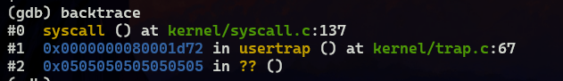

answer: #0

### What is the value of `p->trapframe->a7` and what does that value represent? (Hint: look `user/initcode.S`, the first user program xv6 starts.)

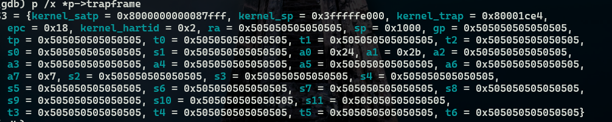

a7等于0x7

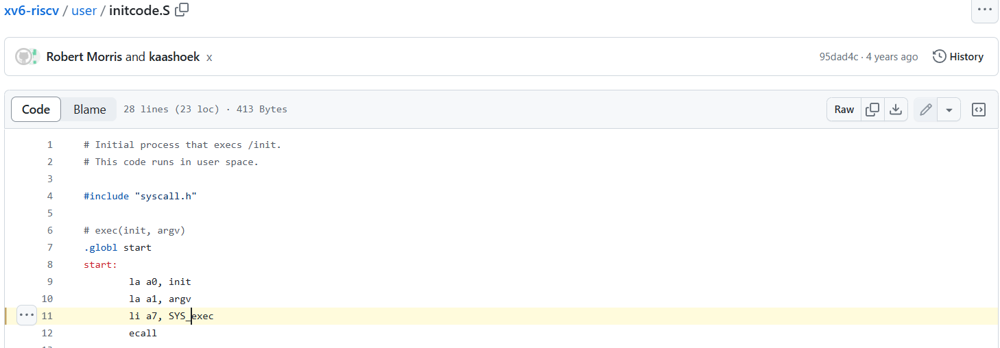

a7传入了SYS_exec 

所以0x7代表SYS_exec 

### What was the previous mode that the CPU was in?

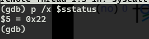

> The SPP bit indicates the privilege level at which a hart was executing before entering supervisor mode. When a trap is taken, SPP is set to 0 if the trap originated from user mode, or 1 otherwise. When an SRET instruction (see Section 3.3.2) is executed to return from the trap handler, the privilege level is set to user mode if the SPP bit is 0, or supervisor mode if the SPP bit is 1; SPP is then set to 0

如果从用户模式发生陷阱，SPP 被设置为 0，从超级监督模式则设置为1；

返回时，spp被置为0；

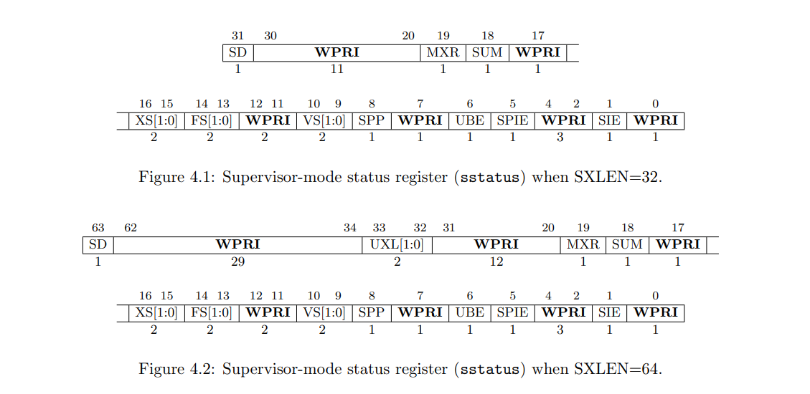

spp为第9位，为0。

由图1知，现在在trap中，故之前的模式是用户模式。

### Write down the assembly instruction the kernel is panicing at. Which register corresponds to the variable `num`?

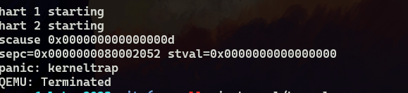

> num = * (int *) 0;
>     80002052:	00002683          	lw	a3,0(zero) # 0 <_entry-0x80000000>

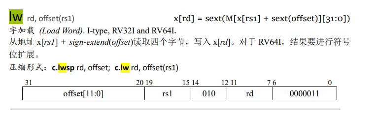

所以变量num存储在a3中

### Why does the kernel crash? Hint: look at figure 3-3 in the text; is address 0 mapped in the kernel address space? Is that confirmed by the value in `scause` above? (See description of `scause` in [RISC-V privileged instructions](https://pdos.csail.mit.edu/6.828/2023/labs/n//github.com/riscv/riscv-isa-manual/releases/download/Priv-v1.12/riscv-privileged-20211203.pdf))

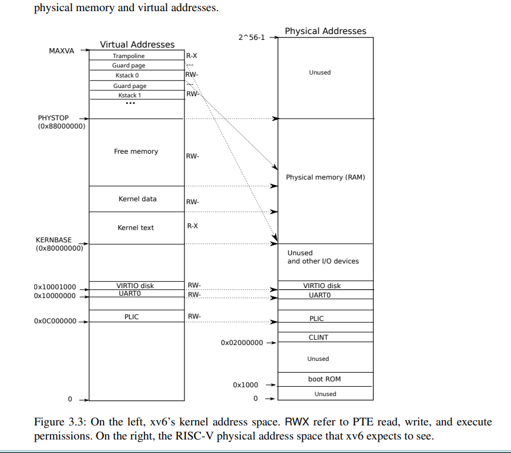

从图可以看出，kernbase=0x80000000是内核开始的空间，所以0不在内核空间。

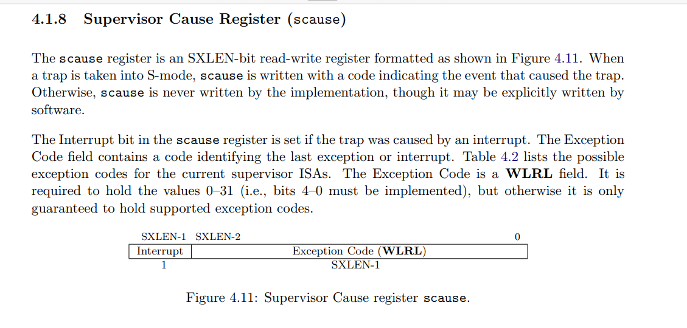

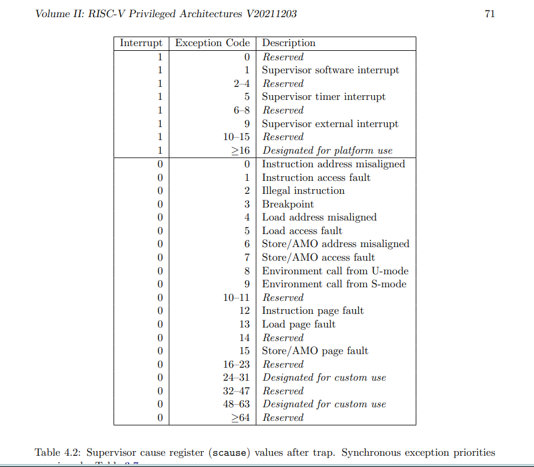

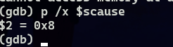

之前scause的值为0xd,所以发生了加载页错误。

### What is the name of the binary that was running when the kernel paniced? What is its process id (`pid`)?

p就是proc结构体

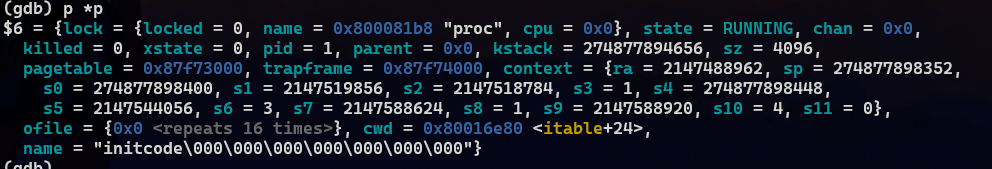

如上图

## System call tracing ([moderate](https://pdos.csail.mit.edu/6.828/2023/labs/guidance.html))

先补充从用户模式引导到内核模式的引导。

在user.h中添加声明：

```c
int trace(int);
```

user.pl:

```c
entry("trace");
```

user.pl生成user.S，查看trace:

```assembly
.global trace
trace:
 li a7, SYS_trace // a7存储系统调用号
 ecall // 调用
 ret // 返回
```

在kernel/sysproc.c中添加系统调用 sys_trace(),并在proc结构体中用一个新变量来存储sys_trace的参数。这个函数的写法，可以模仿文件中其他函数的写法来写。记住往proc结构体添加新变量。

```c
uint64
sys_trace(void){
	int mask;
	argint(0,&mask);
	myproc()->syscall_trace = mask;
	return 0;
}
```

修改fork，将**syscall_trace**传递给子进程。np是子进程proc结构体。

```c
np->sz = p->sz;
np->syscall_trace = p->syscall_trace;
```

修改syscal()和相关的数组,往里面加入打印的语句,同时记得往syscall.h添加信息。

```c
void
syscall(void)
{
  int num;
  struct proc *p = myproc();

  num = p->trapframe->a7;
  if(num > 0 && num < NELEM(syscalls) && syscalls[num]) {
    // Use num to lookup the system call function for num, call it,
    // and store its return value in p->trapframe->a0
    p->trapframe->a0 = syscalls[num]();
    /* new part */
	if((p->syscall_trace >> num) & 1){
		printf("%d:syscall %s -> %d\n",p->pid,syscall_names[num],p->trapframe->a0);
	}
    /* new part end */
  } else {
    printf("%d %s: unknown sys call %d\n",
            p->pid, p->name, num);
    p->trapframe->a0 = -1;
  }
}
```

同时要添加一个系统调用名的数组。

```c
const char* syscall_names[] = {
[SYS_fork]    "fork",
[SYS_exit]    "exit",
[SYS_wait]    "wait",
[SYS_pipe]    "pipe",
[SYS_read]    "read",
[SYS_kill]    "kill",
[SYS_exec]    "exec",
[SYS_fstat]   "fstat",
[SYS_chdir]   "chdir",
[SYS_dup]     "dup",
[SYS_getpid]  "getpid",
[SYS_sbrk]    "sbrk",
[SYS_sleep]   "sleep",
[SYS_uptime]  "uptime",
[SYS_open]    "open",
[SYS_write]   "write",
[SYS_mknod]   "mknod",
[SYS_unlink]  "unlink",
[SYS_link]    "link",
[SYS_mkdir]   "mkdir",
[SYS_close]   "close",
[SYS_trace]   "trace",
[SYS_sysinfo] "sysinfo",

};
```

结果：

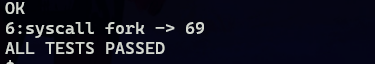

tip: 这里冒号后面少个空格，make grade时候检测不过去。后面改了

## Sysinfo ([moderate](https://pdos.csail.mit.edu/6.828/2023/labs/guidance.html))

与上面类似，不过程序明显要复杂：

```c
uint64
sys_sysinfo(void){
	uint64* s;
	struct proc *p = myproc();
	argaddr(0,(uint64*)&s);
	struct sysinfo info;
	info.freemem = getfreemem();
	info.nproc = getusedproc();
	if(copyout(p->pagetable,(uint64)s,(char*)&info,sizeof info) < 0)
		return -1;
	return 0;
}
```

其中getfreemem()的实现需要仔细月的kalloc.c文件，使用全局变量kmem记得要使用锁（可以从其他函数看出）。

```c
uint64
getfreemem(void)
{
	int count = 0;
	struct run *r;
	acquire(&kmem.lock);
	r = kmem.freelist;
	while(r){
		count += 1;
		r = r->next;
	}
	release(&kmem.lock);
	 
	return count * PGSIZE;
}

```

getusedproc()的实现比较简单，也要仔细看proc.c的数据结构和一两个函数就能得出思路：

```c
uint64
getusedproc(void){
	uint64 n = 0;

	struct proc *p;
	for(p = proc; p < &proc[NPROC]; p++)
		if(p->state != UNUSED)
			n ++;
	return n;
}
```

结果：

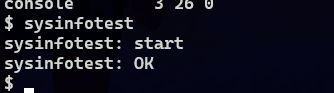

## 总结

 这个lab难度感觉比上个lab难，很多函数和文件，不过要理解xv6调用系统调用的过程：

一开始位于用户模式，user.pl 提供了接口进入内核模式，再通过syscall进入具体的系统调用。


