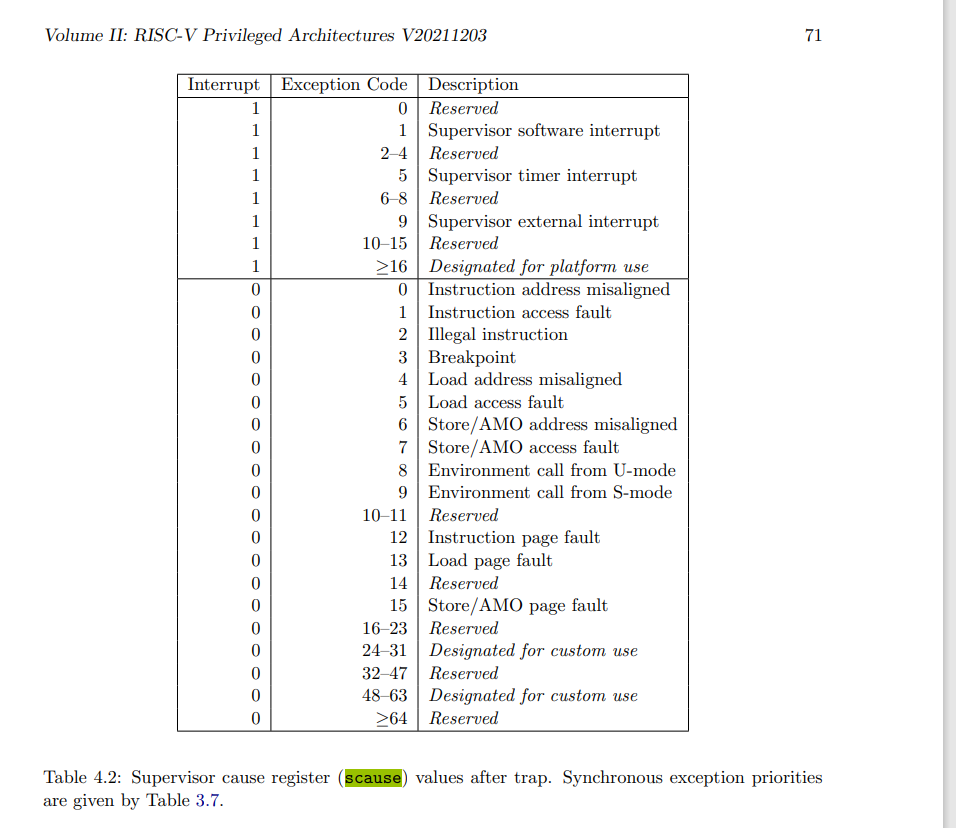
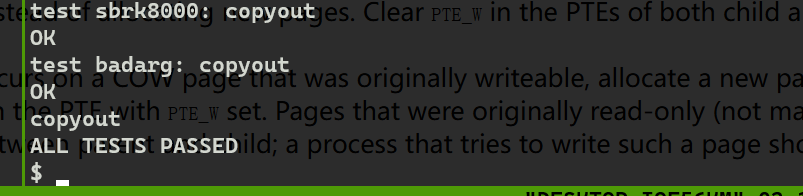

- fork，写实复制时页面全部标记为read，那原本是read-only的页面如何区分？


## lab5: Copy-on-Write Fork for xv6

1. Modify uvmcopy() to map the parent's physical pages into the child, instead of allocating new pages. Clear `PTE_W` in the PTEs of both child and parent for pages that have `PTE_W` set.

原来的代码

```c
// Given a parent process's page table, copy
// its memory into a child's page table.
// Copies both the page table and the
// physical memory.
// returns 0 on success, -1 on failure.
// frees any allocated pages on failure.
int
uvmcopy(pagetable_t old, pagetable_t new, uint64 sz)
{
  pte_t *pte;
  uint64 pa, i;
  uint flags;
  char *mem;

  for(i = 0; i < sz; i += PGSIZE){
    if((pte = walk(old, i, 0)) == 0)
      panic("uvmcopy: pte should exist");
    if((*pte & PTE_V) == 0)
      panic("uvmcopy: page not present");
    pa = PTE2PA(*pte);
    flags = PTE_FLAGS(*pte);
    if((mem = kalloc()) == 0)
      goto err;
    memmove(mem, (char*)pa, PGSIZE);
    if(mappages(new, i, PGSIZE, (uint64)mem, flags) != 0){
      kfree(mem);
      goto err;
    }
  }
  return 0;

 err:
  uvmunmap(new, 0, i / PGSIZE, 1);
  return -1;
}
```

删除kalloc申请新空间的部分代码，增加物理引用页数量。对可写的页，清除PTE_W，设置PTE_OW(originally write),修改后：

```c
// Given a parent process's page table, copy
// its memory into a child's page table.
// Copies both the page table and the
// physical memory.
// returns 0 on success, -1 on failure.
// frees any allocated pages on failure.
int
uvmcopy(pagetable_t old, pagetable_t new, uint64 sz)
{
  pte_t *pte,*newpte;
  uint64 pa, i;
  uint flags;
  //char *mem;

  for(i = 0; i < sz; i += PGSIZE){
    if((pte = walk(old, i, 0)) == 0)
      panic("uvmcopy: pte should exist");
    if((*pte & PTE_V) == 0)
      panic("uvmcopy: page not present");
    pa = PTE2PA(*pte);
    flags = PTE_FLAGS(*pte) ;

    if(mappages(new, i, PGSIZE, pa, flags) != 0){
      goto err;
    }

	// 增加物理引用页数量	
    kaddrfcnt(pa);
	// 清除PTE_W位，设置PTE_COW位代表原本是可写的。	
    if((newpte = walk(new,i,0)) == 0)
		panic("uvmcopy:");
	if((*pte & PTE_W) != 0) 
	{
		*pte =(*pte & ~PTE_W) | PTE_OW;
		*newpte =(*newpte & ~PTE_W) | PTE_OW;
	}
  }
  return 0;

 err:
  uvmunmap(new,0,i/PGSIZE,1);
  return -1;
}
```


2. Modify usertrap() to recognize page faults. When a write page-fault occurs on a COW page that was originally writeable, allocate a new page with kalloc(), copy the old page to the new page, and install the new page in the PTE with `PTE_W` set. Pages that were originally read-only (not mapped `PTE_W`, like pages in the text segment) should remain read-only and shared between parent and child; a process that tries to write such a page should be killed.



page_fault属于exception,store page fault 的scause为15。由于虚拟地址可能大于最大的，所以需要检查。需要清除原来的PTE_OW位，并设置PTE_W位。并将原来的页内容复制过来。减少对原来页的映射。在uvmunmap中，会调用kfree，而kfree会减少引用数量，如果等于0，会进行真正的free。

在这个过程中，发生内存耗尽等情况，要杀死进程。

```c
else {
	  if(r_scause() == 15){
			// write page fault
			uint64 invalidad = r_stval();
			pte_t *pte = 0;

			if(invalidad < MAXVA)
				pte = walk(p->pagetable,invalidad,0);

			if( pte != 0 && (*pte & PTE_OW) != 0){
				// the page was originally writeable
				char* mem;
				uint64 pa = PTE2PA(*pte);
				uint flags = PTE_FLAGS(*pte) | PTE_W;
				flags &= ~PTE_OW;

				if((mem = kalloc()) == 0){
					printf("usertrap(): memory is dead\n");
					setkilled(p);
				}else{

                    memmove(mem,(char*)pa,PGSIZE);
					uvmunmap(p->pagetable,invalidad & ~0xfff,1,1);

					if(mappages(p->pagetable,invalidad & ~0xfff,PGSIZE,(uint64)mem,flags) != 0){
						printf("usertrap(): mappages fault\n");
						kfree(mem);
						setkilled(p);
					}	
				}
				//}
			}else{
				// the page was originally read-only
				printf("usertrap(): unexpected scause %p pid=%d\n", r_scause(), p->pid);
				printf("            sepc=%p stval=%p\n", r_sepc(), r_stval());
				setkilled(p);
			}
	  }else{
		printf("usertrap(): unexpected scause %p pid=%d\n", r_scause(), p->pid);
		printf("            sepc=%p stval=%p\n", r_sepc(), r_stval());
		setkilled(p);
	}
  }
```

3. Ensure that each physical page is freed when the last PTE reference to it goes away -- but not before. A good way to do this is to keep, for each physical page, a "reference count" of the number of user page tables that refer to that page. Set a page's reference count to one when `kalloc()` allocates it. Increment a page's reference count when fork causes a child to share the page, and decrement a page's count each time any process drops the page from its page table. `kfree()` should only place a page back on the free list if its reference count is zero. It's OK to to keep these counts in a fixed-size array of integers. You'll have to work out a scheme for how to index the array and how to choose its size. For example, you could index the array with the page's physical address divided by 4096, and give the array a number of elements equal to highest physical address of any page placed on the free list by `kinit()` in kalloc.c. Feel free to modify kalloc.c (e.g., `kalloc()` and `kfree()`) to maintain the reference counts.

这一步要修改kalloc，free，以及一个数组，来保证引用数量的正确加减。将数量加减抽象到两个函数，方便调用。另外这里使用int的原因是，kinit会将物理内存free一遍，会将数量减到负数，所以要用int。

```c
int pg_rf_cnt[PHYSTOP/PGSIZE + 10];

void kaddrfcnt(uint64 pa){
	pg_rf_cnt[pa/PGSIZE] ++;
}

void ksubrfcnt(uint64 pa){
	--pg_rf_cnt[pa/PGSIZE];
}
```

修改kfree，使kfree，在引用数量小于等于0时才被free。这应该就是透明性。对用户来说都是kfree。

```c
void
kfree(void *pa)
{
  struct run *r;

  ksubrfcnt((uint64)pa );

  //check the number of links to  the physical page
  if(pg_rf_cnt[(uint64)pa/PGSIZE] > 0) return;

  if(((uint64)pa % PGSIZE) != 0 || (char*)pa < end || (uint64)pa >= PHYSTOP)
    panic("kfree");

  // Fill with junk to catch dangling refs.
  memset(pa, 1, PGSIZE);

  r = (struct run*)pa;

  acquire(&kmem.lock);
  r->next = kmem.freelist;
  kmem.freelist = r;
  release(&kmem.lock);
}
```

kalooc就比较简单，调用时将相应数量设置为1.

```c
void *
kalloc(void)
{
  struct run *r;

  acquire(&kmem.lock);
  r = kmem.freelist;
  if(r)
    kmem.freelist = r->next;
  release(&kmem.lock);

  if(r)
    memset((char*)r, 5, PGSIZE); // fill with junk
  pg_rf_cnt[(uint64)r/PGSIZE] = 1;
  return (void*)r;
}
```

4. Modify copyout() to use the same scheme as page faults when it encounters a COW page.

和捕获page-fault一样。

```c
int
copyout(pagetable_t pagetable, uint64 dstva, char *src, uint64 len)
{
  uint64 n, va0, pa0 = 0;
  pte_t *pte;

  while(len > 0){
    va0 = PGROUNDDOWN(dstva);
    if(va0 >= MAXVA)
      return -1;
    pte = walk(pagetable, va0, 0);
    if(pte == 0 || (*pte & PTE_V) == 0 || (*pte & PTE_U) == 0 ||
       ((*pte & PTE_W) == 0 && (*pte & PTE_OW) ==0 ))
      return -1;
	else if((*pte & PTE_OW) != 0){
		uint64 pa1 = PTE2PA(*pte);
		uint flags = PTE_FLAGS(*pte) | PTE_W;
		flags &= ~PTE_OW;
		if((pa0 = (uint64)kalloc()) == 0){
			return -1;
		}
		// 鍑忓皯鐗╃悊椤佃繛鎺ユ暟
		memmove((char*)pa0,(char*)pa1,PGSIZE);
		uvmunmap(pagetable,va0,1,1);
		if((mappages(pagetable,va0,PGSIZE,pa0,flags)) != 0){
			kfree((char*)pa0);
			printf("copyout:");
			return -1;
		}
	}else if((*pte & PTE_W) != 0)
    	pa0 = PTE2PA(*pte);
    n = PGSIZE - (dstva - va0);
    if(n > len)
      n = len;
    memmove((void *)(pa0 + (dstva - va0)), src, n);

    len -= n;
    src += n;
    dstva = va0 + PGSIZE;
  }
  return 0;
}
```

### 结果



### 总结

这个lab算是这么多lab中代码量比较大的了。一开始没将减少物理页引用数量的操作放在kfree函数中，仅仅在copyout，page fault这几个函数中进行了这个操作。这可能导致其他调用kfree的函数（我们不可能在每个kfree前面加上减少引用的操作），没有减少引用数量，从而导致页无法被释放。